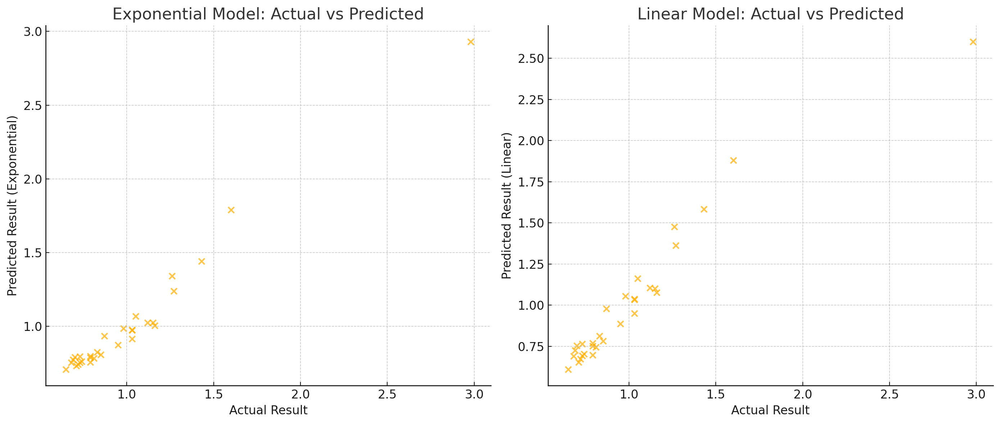

# Phase C — Exponential risk sizing from ATR (curve fitting)

## Motivation

Phase B's fixed, per-band Stop Loss / Take Profit values did not generalise. The fix: make risk a
**smooth function of volatility** instead of a hand-picked constant. In calm markets (low ATR) the
stop should be tight; in volatile markets (high ATR) it should widen, so normal noise does not
knock the position out.

## Choosing the shape

A few anchor points were picked by hand to describe the desired Stop Loss curve as a function of
ATR — roughly:

| ATR | target Stop Loss |
| --- | --- |
| 0.225 | 620 |
| 0.275 | 1400 |
| 0.350 | 1700 |
| 0.450 | 2000 |

The curve had to grow quickly at first and then flatten, and its steepness had to be adjustable by
a single coefficient. An **exponential** is the natural family for that.

## Why an exponential (the derivation)

The requirement started very concretely — a coefficient was needed so that, for a reference move of
~620, `0.25` maps to about `500` and `0.5` to about `1500`. Generalising that into a smooth,
tunable curve gives:

```
f(x) = A · (e^(k·x) − 1)
```

with anchor behaviour `f(0.25) ≈ 300–500`, `f(0.5) ≈ 1500`, `f(0.8) ≈ 1600–1800`. The parameter
`k` controls how quickly the curve rises — a larger `k` packs more growth into the low-`x` region —
which is exactly the adjustable steepness the Stop Loss needed.

This is also why **ATR** is the natural input: a higher ATR means faster, larger price swings (a
kind of volatility "frequency"), so an exponential in ATR widens the stop precisely when the swings
get bigger.

## The fit

[`../curve_fitting.py`](../curve_fitting.py) fits `a·e^(b·x) + c` to those points with
`scipy.optimize.curve_fit`:

```python
def model(x, a, b, c):
    return a * np.exp(b * x) + c
```



The exponential clearly tracks the anchor points better than a straight line, confirming the
exponential form.

## Result — the risk functions used by the strategy

The fitted shape becomes the risk-sizing functions in [`../testing.py`](../testing.py), with the
tuning coefficients **Ks** and **Kt** exposed:

```python
def get_stop_loss_function(atr, k):     # k == Ks
    return 1400 * (np.exp(k * atr) - 1)

def get_take_profit_function(k):        # k == Kt
    return np.exp(0.8459 * k) - 1
```

So:

- **Stop Loss** grows exponentially with ATR, scaled by **Ks**.
- **Take Profit** is a multiple of the Stop Loss, scaled by **Kt** (the `0.8459` coefficient also
  comes from a fit).

Phase D later refines the Stop Loss into a **two-term** exponential that depends on *both* Ks and
ATR (fitted coefficients `a = −0.0280`, `b = 2.0145`, `c = 0.411`):

```
StopLoss% = a·e^(b·Ks) + c·e^(b·ATR) = −0.0280·e^(2.0145·Ks) + 0.411·e^(2.0145·ATR)
```

## Why this matters

Risk is now sized by a principled, continuous rule rather than brittle constants. With that in
place, `main()` can sweep `(Ks, Kt)` across rolling windows and record every configuration's
outcome to `parameters.csv`. That dataset is the input for the next phases, which ask the real
question: **can the best Ks/Kt be predicted from market conditions at all?**
