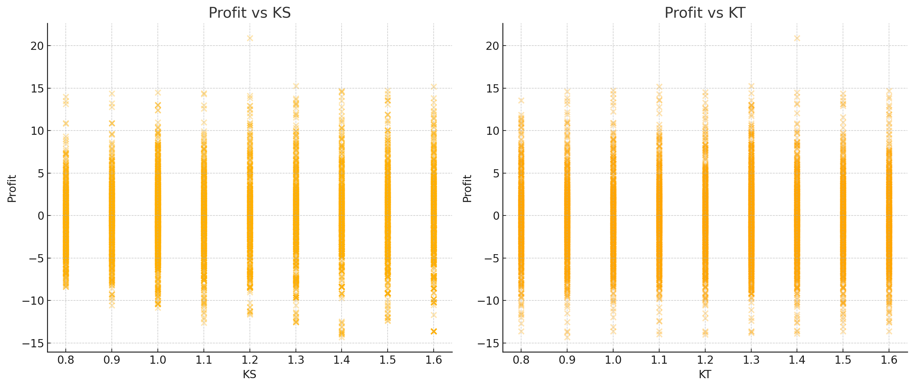
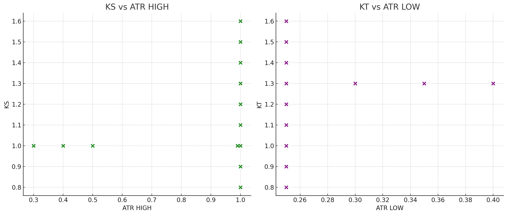
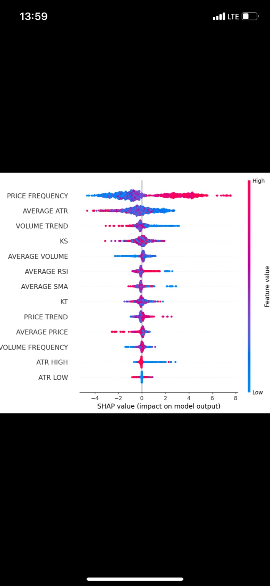

# Phase E — Can Ks/Kt be predicted from market conditions?

## The question

Phases A–D kept hoping the risk coefficients Ks/Kt could be set from the market. Phase E stops
guessing and **measures it directly**: given the market features of a window (ATR, number of
trades, price frequency, volume, RSI, SMA, momentum), can we predict the profitable Ks/Kt — or the
profit itself?

## Methods and results

Every standard tool was tried on the parameter/outcome dataset. Full table in
[`../results/ks_kt_predictability_metrics.csv`](../results/ks_kt_predictability_metrics.csv):

| method | target | metric | value |
| --- | --- | --- | --- |
| correlation | Ks vs ATR_HIGH | corr | 0.21 (weak) |
| linear regression | Ks | R² | 0.05 |
| linear regression | Kt | R² | 0.007 |
| polynomial (deg 2) | profit | R² | 0.0025 |
| Random Forest | Ks | R² | 0.21 |
| Random Forest | Kt | R² | -0.005 |
| Random Forest | profit | R² | 0.237 |
| neural network | Ks/Kt | R² | negative |

Every model is weak: the best explains ~24% of profit variance, and Kt is essentially
unpredictable. `feature_analysis.py` reproduces the Random Forest + SHAP part.

## Visual evidence

- Profit is spread across the whole Ks/Kt plane rather than concentrated — no strong dependency:

  

- Ks/Kt show only a faint tie to ATR:

  

- SHAP ranks PriceFrequency, AverageATR and VolumeTrend as the most influential features for
  profit — but their overall contribution is still small:

  

## The trap that made it look solved (data leakage)

At one point a Random Forest predicting profit reported **R² = 0.91** — apparently excellent. But
that model **included Ks and Kt among its inputs**, and profit in the dataset was *computed from*
Ks and Kt. The model was simply reading back its own answer — textbook **data leakage**. Removing
Ks/Kt and predicting profit from genuine market features drops R² to **0.237**.

This is the key lesson of the whole pre-order-blocks era: a headline metric (0.91) can be an
artefact; the honest number (0.237) says the edge is weak.

## Conclusion → the pivot

Across correlation, linear and polynomial regression, Random Forest, SHAP and a neural network,
the profitable parameters are **not reliably predictable** from market conditions, and profit
itself is only weakly explained. The parameter-driven approach had hit a ceiling.

That negative result — not a failure but a finding — is what motivated the change of direction in
the next phase: from predicting parameters to reading **price action / market structure** (Order
Blocks).
