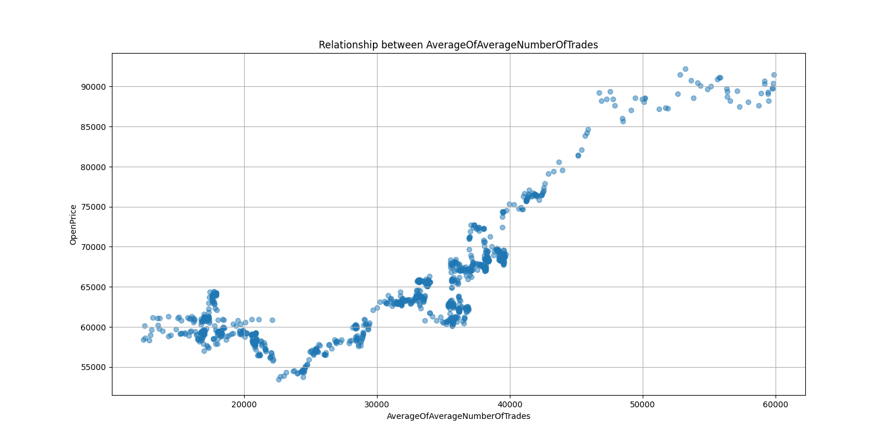

# Phase F - What drives price, and the level-vs-return trap

## Setup

In the "breaking 2020" study the dataset was widened to **18 columns** - every indicator and its
rolling averages, including a doubly-smoothed one, `AverageOfAverageNumberOfTrades`
(the average of the average number of trades). A Random Forest was asked which features drive price,
for **two different targets**:

1. the **open price level** (`OpenPrice`), and
2. the **price change** (`ClosePrice - OpenPrice`).

`price_drivers_analysis.py` reproduces both; the importances are in
[`../results/feature_importance_price_drivers.csv`](../results/feature_importance_price_drivers.csv).

## How the two targets are built

Both targets come straight from the candle's own columns in `values.csv`:

- **Open price level** = the `OpenPrice` column - the raw price at the start of the candle.
- **Price change (return)** = `ClosePrice − OpenPrice`, computed per candle in
  `price_drivers_analysis.py` as `data["ClosePrice"] - data["OpenPrice"]`. This is the actual
  directional move of the candle - the quantity a trade would try to capture - so it is the only
  target that is meaningful for a strategy.

A **Random Forest** (100 trees, a non-linear model) is fitted separately for each target, and the
feature importances are normalised to percentages.

## Result

| feature | importance on **open price** (%) | importance on **price change** (%) |
| --- | --- | --- |
| AverageOfAverageNumberOfTrades | **83.02** | 6.43 |
| AverageATR | 7.06 | 3.87 |
| AverageQuoteAssetVolume | 5.87 | 8.31 |
| AverageTakerBuyBaseAssetVolume | 3.29 | 5.02 |
| AverageVolume | 0.19 | 6.08 |
| AverageNumberOfTrades | 0.17 | 5.98 |
| AveragePriceFrequency | 0.15 | 6.15 |
| PriceFrequency | 0.12 | 4.72 |
| SMA | 0.05 | 7.54 |
| ATR | 0.05 | 6.80 |
| RSI | 0.02 | 9.60 |
| QuoteAssetVolume | 0.01 | 8.87 |
| Volume | 0.00 | 5.88 |
| NumOfTrades | 0.00 | 8.05 |
| TakerBuyBaseAssetVolume | 0.00 | 6.70 |

*(All 15 features, nothing omitted - same numbers as
[`../results/feature_importance_price_drivers.csv`](../results/feature_importance_price_drivers.csv).)*

- Predicting the **level**, one feature - `AverageOfAverageNumberOfTrades` - dominates at **83%**.
- Predicting the **change**, that same feature drops to **6.4%** and *no* feature dominates; the
  importance is spread fairly evenly (RSI 9.6%, QuoteAssetVolume 8.9%, NumOfTrades 8.0%, …).

## Why the 83% is a mirage

`AverageOfAverageNumberOfTrades` is a **doubly-smoothed, slowly-drifting** series. Over 2017–2020
both it and the BTC price level trended upward together, so a tree can "predict" the price level
almost perfectly just by reading this slow trend. That is **autocorrelation of a non-stationary
series**, not a tradeable signal.

The moment the target becomes the **return** (close − open) - the thing that actually matters for
trading - the illusion vanishes: importance collapses to ~6% and nothing predicts.

The chart shows why: the smoothed feature and the price level drift together, so a model "explains"
the level without any real predictive power.

> Lesson: **predicting the price *level* is easy and useless; predicting the *return* is hard.**
> A spectacular importance on a non-stationary target is a classic spurious result.

At the time, the explanation offered for the 83% was hand-wavy (liquidity, momentum). The real
cause is the level-vs-return / non-stationarity trap above.

## Conclusion → the pivot

Phase F closes the parameter/feature-prediction era with the same verdict as Phase E: the measured
features do **not** predict returns. Predictive, indicator-based modelling had reached its limit,
which is what pushed the project toward **market-structure / price-action** methods (Order Blocks)
in the next phase.
