# Phase G - Order Blocks (Smart Money Concepts)

Phases A–F closed the indicator/parameter era with a clear negative result: measured market
features do **not** predict returns or the optimal risk parameters. That verdict pushed the project
away from parameter optimisation and toward **market-structure / price-action** methods. Phase G is
that pivot - a different modelling philosophy based on **Smart Money Concepts (SMC)**.

The code for this phase lives in [`../order_blocks/`](../order_blocks/) rather than evolving
`testing.py`, because it is a separate engine: it reasons about swing structure and zones, not about
RSI/ATR thresholds.

## The concepts

| Term | Meaning |
| --- | --- |
| **Order Block (OB)** | The last candle before a strong directional move - a zone where large ("institutional") orders are assumed to sit and where price often reacts on a retest. |
| **Fair Value Gap (FVG)** | A price imbalance between three consecutive candles; used here both as an order-block trigger and as a confirmation feature. |
| **Change of Character (CHoCH)** | A break of the prior swing structure signalling a possible trend reversal (e.g. an uptrend making its first lower-high / higher-low break). |
| **Break of Structure (BOS)** | A break of the prior swing high/low in the direction of the trend, confirming continuation. |

The intended trade is **multi-timeframe**: read structure and the relevant order block on the higher
timeframe (1H), then wait for a CHoCH confirmation on the lower timeframe (15min) before entering at
the order-block boundary, with the stop just beyond the block and the target at the next structural
level.

Two annotated examples of the concepts together - the order block, the Fair Value Gap inside it, and
the liquidity resting above/below the structure:

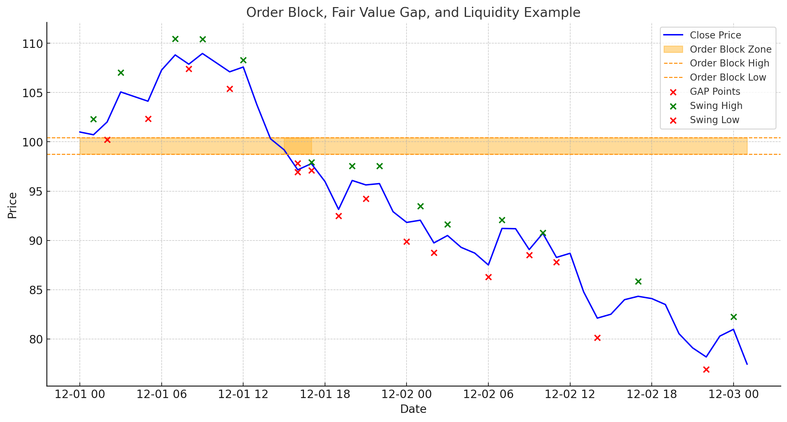

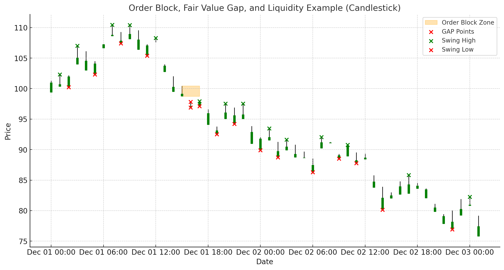

A Break of Structure (BOS) versus a Change of Character (CHoCH) on the order-block structure:

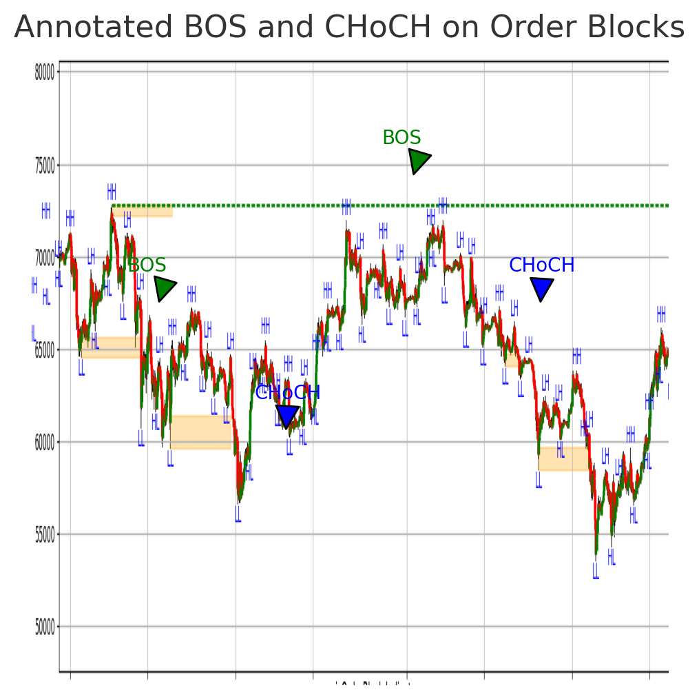

## Detection pipeline

### 1. Swings, FVG and volume-based order blocks - [`order_blocks.py`](../order_blocks/order_blocks.py)

- `detect_swing_highs_and_lows` finds local extrema with `scipy.signal.find_peaks` (minimum bar
  distance `window`).
- `label_swings` tags each swing **HH / HL / LH / LL** relative to the previous swing of its type.
- `detect_fvg` measures the Fair Value Gap for every candle as a **percentage of the candle body**:

  $$\text{FVG}\% = \frac{\min(\text{gap sides})}{\text{body size}}\times 100$$

- `detect_order_blocks_with_zone` opens an order block when `FVG% > 50` and keeps the zone active
  (`isOrderBlock = 1`) until price trades back into the block low or a **10-day** window elapses.

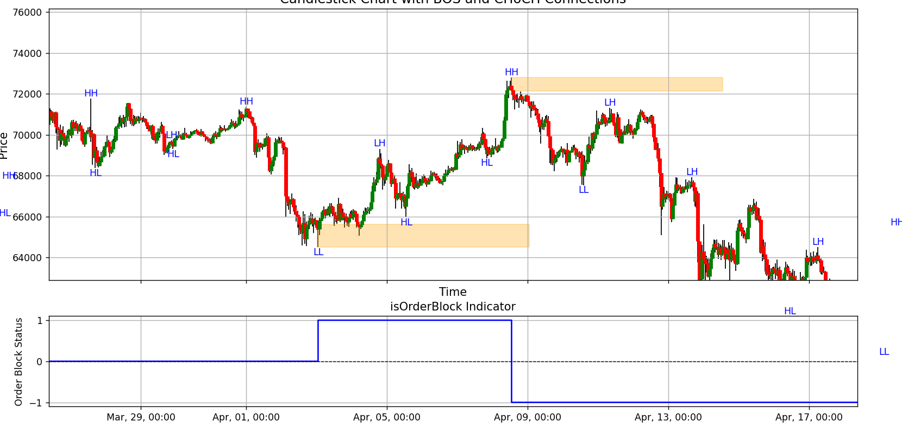

*Swing labels, the active order-block zone (orange), and the `isOrderBlock` state in the lower panel.*

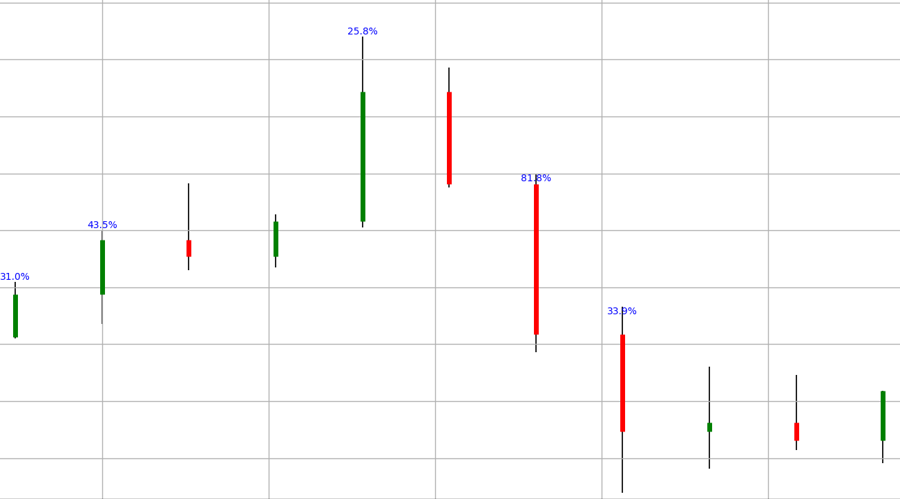

### 2. CHoCH structure and CHoCH order blocks - [`structure.py`](../order_blocks/structure.py)

A cleaner structural view is built on a **smoothed price** (SMA-10) with a **volatility filter** so
that only meaningful pivots survive:

- `detect_strict_local_maxima` / `minima` - strict local extrema of the SMA.
- `calculate_scaled_volatility_for_maxima` / `minima` - keep a pivot only if the exponentially
  scaled move to the previous pivot exceeds `threshold` (default `0.13`):

  $$v = 100\cdot\overline{\left(e^{\,|\Delta \text{SMA}|/\text{SMA}_{-1}} - 1\right)}$$

- `label_swings_SMA` - HH/HL/LH/LL on the filtered pivots.
- `found_triangle_maxima` / `found_triangle_minima` - detect the CHoCH "triangle": a pullback of at
  least `drop_percent`, an intermediate pullback of at least `drop_percent − 1`, and a recovery of at
  least `rise_percent`, all confirmed by **above-average volume**.
- `label_CHoCH_order_blocks` - turn confirmed CHoCH pivots into active zones
  (`isCHoCHOrderBlock = ±1`).

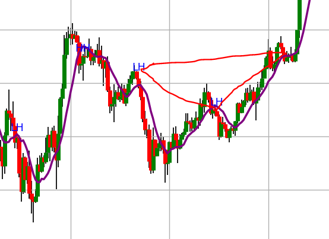

*The SMA (purple) with the triangle construction used to confirm a Change of Character.*

Tunable parameters: `drop_percent`, `rise_percent`, and the volatility `threshold` (documented at the
top of `structure.py`).

## The ML angle: an order-block quality classifier

Rule-based detection produces **many** candidate zones, most of which never lead to a clean move.
[`ob_classifier.py`](../order_blocks/ob_classifier.py) trains a small **`DecisionTreeClassifier`**
(`max_depth=5`) on manually validated order blocks, using four features - `volume`, `Volume_MA`,
`FVG`, `ATR` - min-max scaled. Predictions then pass a strict post-filter:

```
OrderBlockPred == 1  AND  OrderBlockProb >= 0.9
AND volume > 1.5 × Volume_MA  AND  FVG present  AND  ATR > mean(ATR)
```

The trained model is saved as
[`../order_blocks/order_block_model.pkl`](../order_blocks/order_block_model.pkl), and a scored run
is in [`../results/order_blocks_detected.csv`](../results/order_blocks_detected.csv) (columns include
`FVG`, `VolumeDiff`, `isSwingLow`, `isSwingHigh`, `Trend`, `OrderBlockProb`, `OrderBlock`).

This is the constructive ML result of the phase: a model artefact that ranks order blocks by quality
so that only high-confidence zones are traded.

## The ML angle that failed: predicting the Stop Loss

The recurring question from the parameter era returned here too - *can a model pick the right Stop
Loss?* Per-order features were labelled by their best Stop-Loss bucket and several classifiers were
tried. The reported accuracies:

| model | accuracy on Stop-Loss class |
| --- | --- |
| Random Forest | **~0%** |
| Logistic Regression | ~3% |
| Support Vector Machine | ~1% |

The features carried essentially no information about the optimal Stop Loss, compounded by heavy
**class imbalance** across the Stop-Loss buckets. This is the same lesson as Phase E, now in the SMC
setting: the entry structure can be modelled, but the *risk parameter* cannot be predicted from these
features.

Even though the classifier could not assign the exact Stop-Loss class, the Random Forest **feature
importances** were still inspected, and the distributions of the three most important features -
`ADX_day`, `ATR_day` and `AverageVolume` - were plotted across the Stop-Loss classes to see whether a
feature *range* (rather than a point prediction) could inform a heuristic rule.

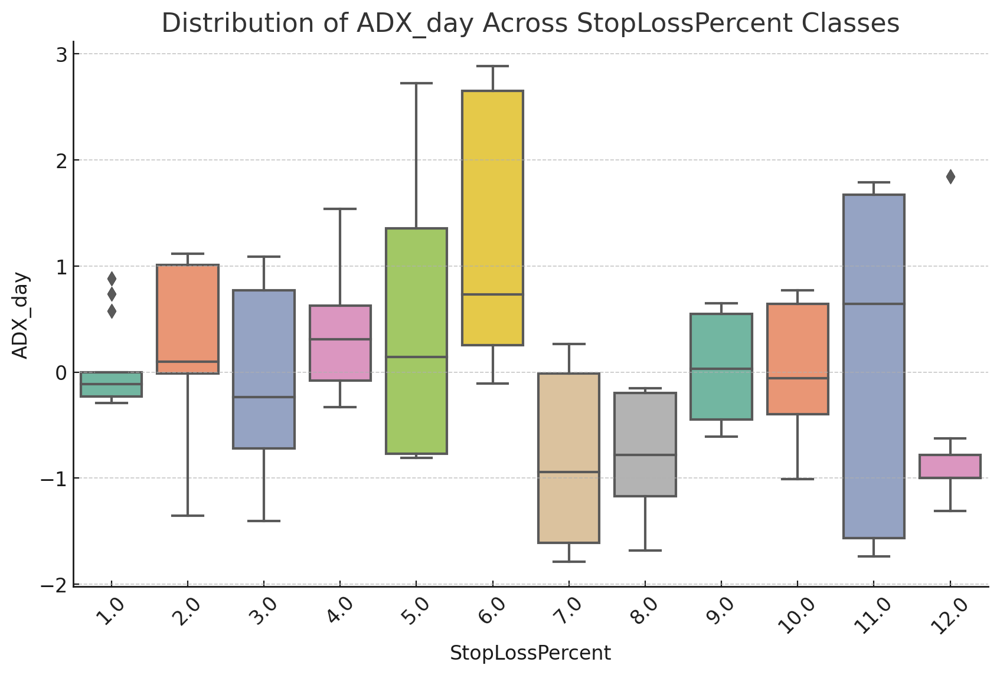

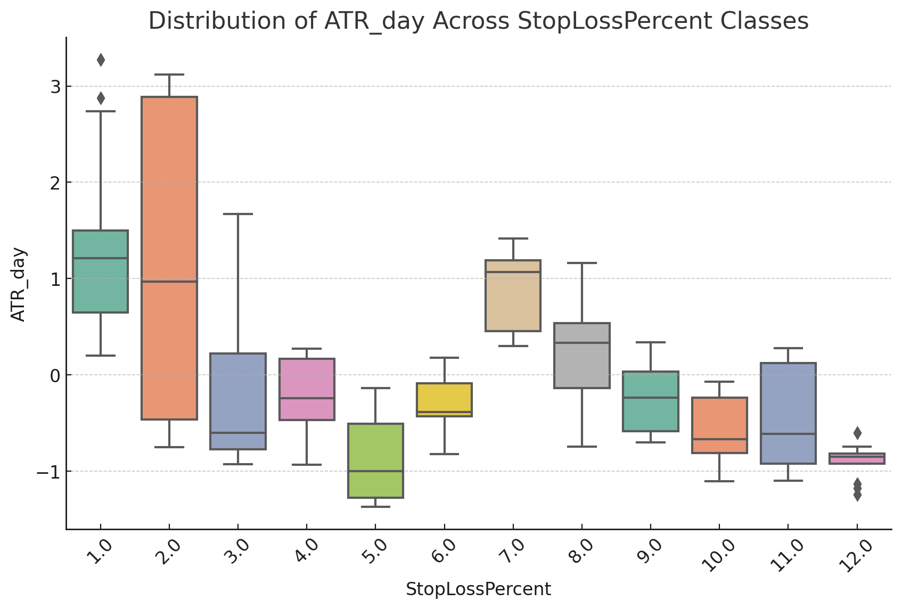

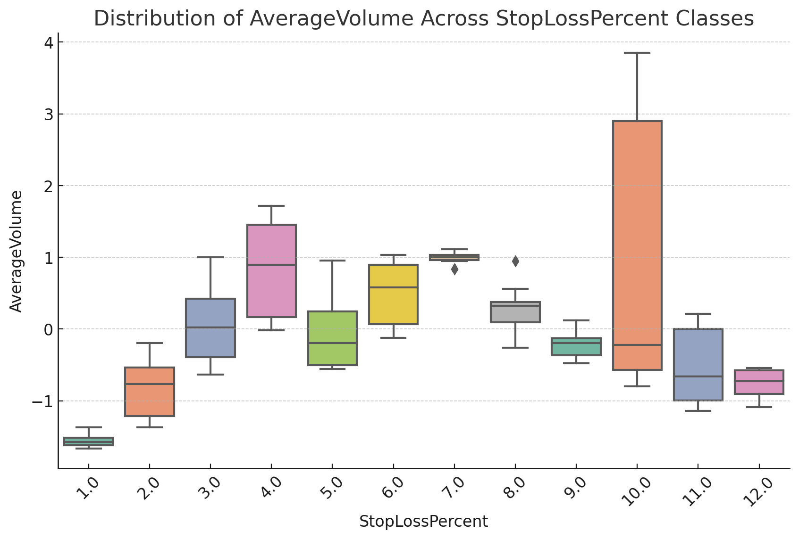

*Distributions of the three most important parameters (by Random Forest importance) for the different
Stop-Loss percentage classes - showing how the values differ between classes.*

The goal was to identify value ranges specific to certain Stop-Loss percentages and turn them into
simple rules ("use this Stop Loss when the feature falls in this band"). In practice the class
distributions overlapped too much to yield a robust rule - consistent with the near-zero classifier
accuracy above.

## Backtest: good for one year, unstable across regimes

The discretionary **CHoCH + BOS** tactic (enter after a bullish CHoCH and a subsequent BOS, exit on
the opposite CHoCH) was backtested with fixed risk of **2% Stop Loss / 5% Take Profit**. On the most
recent year it produced roughly **55% stops / 45% targets** - workable - but earlier years behaved
very differently. Detecting the structure looked convincing on-chart, yet profit did **not** grow
consistently as the backtest window lengthened.

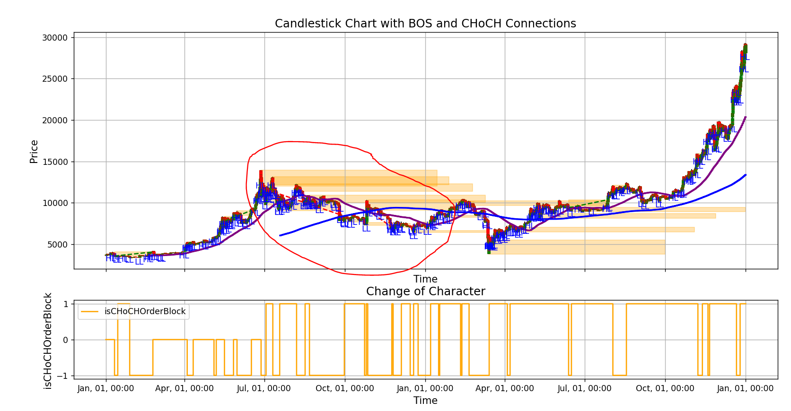

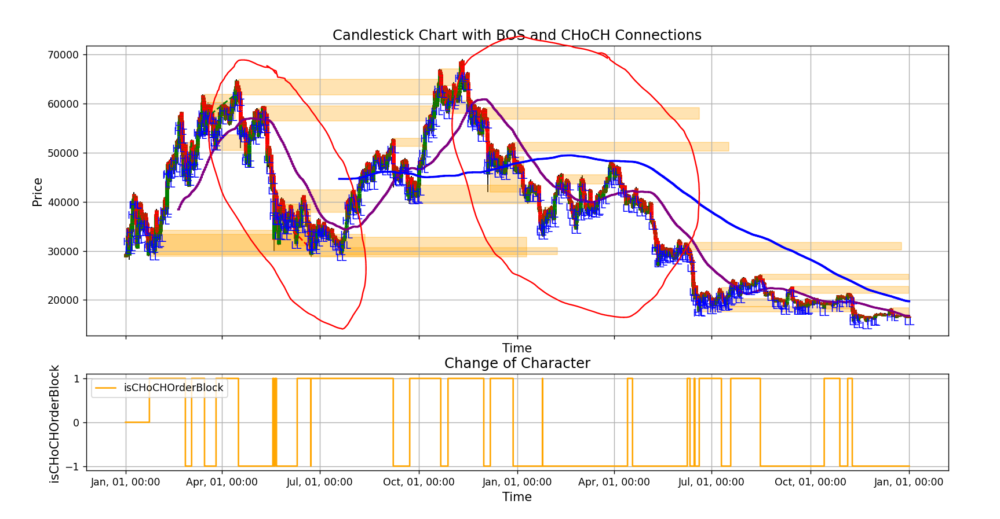

*The same detector across two very different regimes - 2019–2020 (accumulation/early bull) vs.
2021–2022 (full bull-then-bear cycle). The structure is detected in both, but a fixed 2%/5% rule that
works in one regime does not carry over to the other.*

## Conclusion → the pivot to the final strategy

Phase G shows both sides of the SMC approach honestly:

- **Constructive:** a working structural detector (swings, FVG, CHoCH/BOS, multi-timeframe) and a
  Decision-Tree classifier that filters order blocks by quality - an actual trained model artefact.
- **Negative:** the strategy is **regime-dependent** (good for one year, unstable across years) and
  ML could **not** predict the Stop Loss.

The instability is exactly what motivated the next and final step. The research log ends by
converging on a **Trend + Momentum** design - EMA 200 for trend direction, EMA 50 for entries, RSI
for momentum confirmation and **ATR-based Stop Loss / Take Profit** - which became the foundation of
the project's final scoring strategy.
